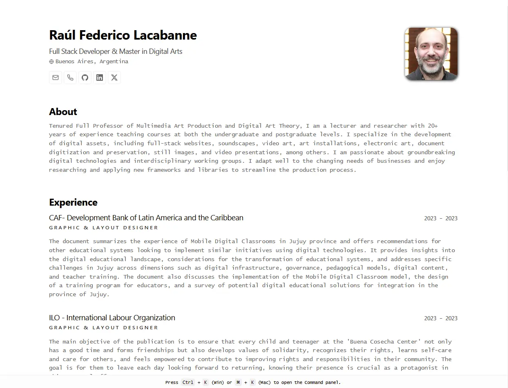

# Raúl Federico Lacabanne | Minimalist & Printable Bilingual Resume

[](https://astro.build/)
[](https://www.typescriptlang.org/)
[](https://opensource.org/licenses/MIT)
[](https://github.com/knnv-ar/resume/actions/workflows/deploy.yml)

An interactive, minimalist, and print-optimized resume built on top of the **JSON Resume** standard schema. The application is bilingual, supporting both Spanish (default) and English, and incorporates modern design aesthetics with full dark-mode support and keyboard navigation.



---

## ✨ Features

- 🌐 **Bilingual Out-of-the-box:** Spanish version (`/`) and English version (`/en/`) mapped to structured data.
- ⌨️ **Command Palette (`ninja-keys`):** Interactive floating keyboard navigation console triggered with `Ctrl + K` (Win) or `⌘ + K` (Mac) to quickly access social profiles and quick actions.
- 🖨️ **Print & PDF Optimized:** Powered by CSS `@media print` directives to automatically hide interactive elements (such as the keyboard manager, command panel, and footer) and layout the resume perfectly for physical printing or PDF export.
- 🌓 **Auto Light/Dark Mode:** Matches user system preferences with custom theme overrides and optimized high-contrast elements.
- ⚙️ **Data-Driven:** Fully structured in [JSON Resume Schema](https://jsonresume.org/). Edit your details in a single location without touching component HTML code.

---

## 📂 Project Structure

```text
├── 📂 .github/workflows/
│   └── deploy.yml          # GitHub Actions deploy configuration to GitHub Pages
├── 📂 public/
│   ├── favicon.svg         # Tab icon
│   └── me.webp             # Profile picture
├── 📂 src/
│   ├── 📂 components/      # UI Layout components & sections
│   │   ├── KeyboardManager.astro
│   │   └── 📂 sections/    # Modular sections (Hero, Experience, Skills, etc.)
│   ├── 📂 icons/           # Inlined SVG vector icons for contacts/networks
│   ├── 📂 i18n/
│   │   └── utils.ts        # UI Translation dictionaries
│   ├── 📂 layouts/
│   │   └── Layout.astro    # Base template layout containing styles
│   └── 📂 pages/
│      ├── index.astro      # Main page (Spanish)
│      └── 📂 en/
│         └── index.astro   # Main page (English)
├── cv-es.json              # Resume data in Spanish (Default)
├── cv-en.json              # Resume data in English (Secondary)
├── astro.config.mjs        # Astro site configuration
└── tsconfig.json           # TypeScript alias paths mapping (@/*, @cv-es, @cv-en)
```

---

## 🛠️ Getting Started

### Prerequisites
Make sure you have Node.js installed on your machine.

### Installation

1. **Clone this repository:**
   ```bash
   git clone https://github.com/knnv-ar/resume.git
   cd resume
   ```

2. **Install the dependencies:**
   ```bash
   npm install
   ```

3. **Start the local development server:**
   ```bash
   npm run dev
   ```
   Open [http://localhost:4321](http://localhost:4321) in your browser to preview the site.

---

## ⚙️ Customization

### 1. Update CV Data
To change the curriculum information, edit the following files at the project root directory:
- 🇪🇸 **Spanish:** [cv-es.json](file:///D:/code/resume-es/cv-es.json)
- 🇬🇧 **English:** [cv-en.json](file:///D:/code/resume-es/cv-en.json)

### 2. Interface / Button Translations
If you add new UI labels or need to modify general text translations (e.g. titles of sections or text placeholders):
- Edit [src/i18n/utils.ts](file:///D:/code/resume-es/src/i18n/utils.ts).

### 3. Change Profile Photo
Simply replace the picture file located at `public/me.webp` with your own photo.

---

## 🖨️ PDF / Printing Guidelines

To save or print the resume as a high-quality PDF:
1. Open your browser's Print window (`Ctrl + P` or `⌘ + P`).
2. Set **Destination** to *Save as PDF*.
3. (Optional) Toggle **Background graphics** and **Headers and footers** in settings to clean up the margins.
4. Click **Save**.

The page's print stylesheet will automatically adapt headers, hide non-printable panels, and style badges/elements for the page size.

---

## 🚀 Deployment

The project is configured to automatically build and deploy to GitHub Pages on every push to the `main` branch. 

To configure manually, edit the `site` and `base` fields in [astro.config.mjs](file:///D:/code/resume-es/astro.config.mjs):
```javascript
export default defineConfig({
  site: 'https://<your-username>.github.io',
  base: '/<repository-name>',
});
```

---

## 📝 License & Credits

- Adapted from [midudev's minimalist-portfolio-json](https://github.com/midudev/minimalist-portfolio-json).
- Inspired by [BartoszJarocki/cv](https://github.com/BartoszJarocki/cv).
- Licensed under the **MIT License**.